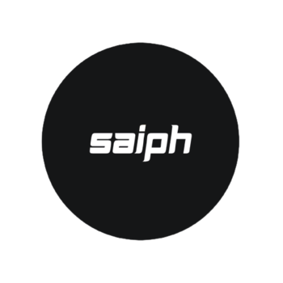
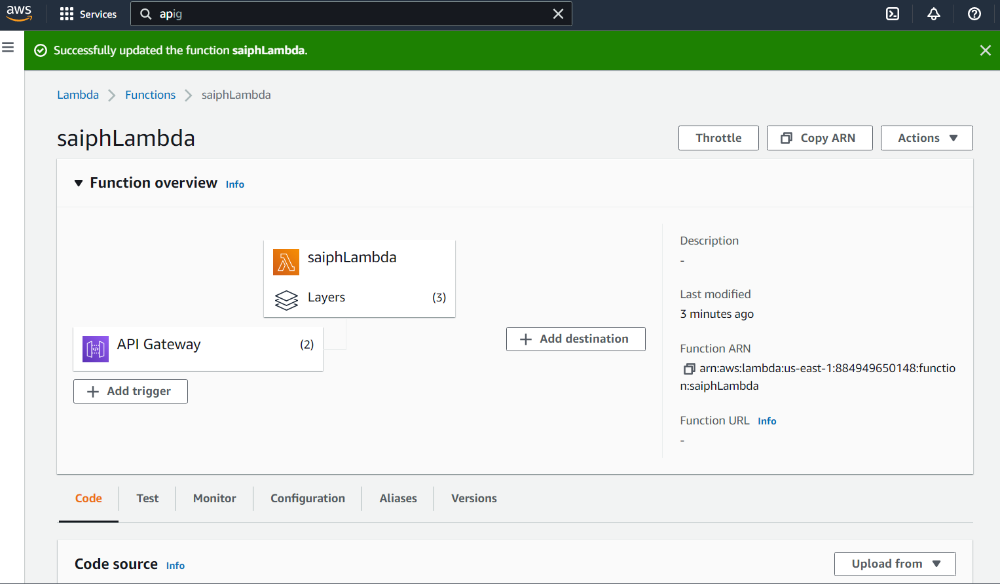
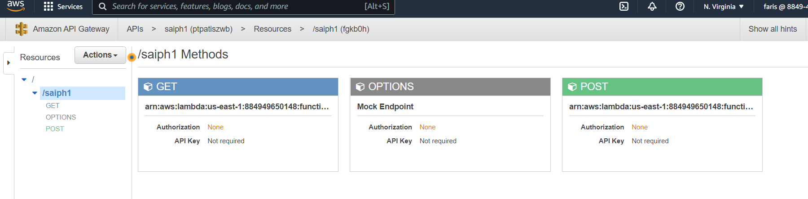

## Contents :
#### Problem Statement		
#### Solution Proposal	
#### what makes it different  (the benefits )	
#### Our Models	
#### Clean Code	
#### Code Deployment	
#### API	
#### Extension	
#### Future Look	
#### Summary	

## Problem Statement
Searching is one of the most wanted skills in the world of business, where software development, consulting, teaching, or even sales requires a lot of searching to do the job, besides the most in-demand jobs on the market like data scientists, analysts, or cybersecurity specialists all need to search for being up to date.
However, there is unanimous agreement that this process has significant problems, especially when diving deep into the details of searching on some topics.
There is a problem in expressing what we have in mind the way that we could reach helpful resources on the web. So we either lose numerous amounts of valuable information we are looking for or waste time trying to read through the web page line by line manually to find what we need. 
#### The problem is wide
This problem is applicable in the searching process in every language that exists. But it’s more intense when it comes to searching by the Arabic language since it’s less supported than the English language all over the web.
The amount of time and effort spent without getting any benefit hinders the search process, especially for students and researchers. This also makes it hard for people with expression and language weaknesses to search on a web page confidently knowing they will find what they need. So because of the demand, tools to develop and make searching easier appeared.
### Solution Proposal
The proposed solution is Saiph, which is a smart artificial intelligence search system that enables the user to perform accurate searches and get the desired results easily and quickly.

Saiph examines files, web pages, and databases looking for certain information to be extracted by searching for all synonyms of the term. In addition to any word that shares the same meaning by including a linguistic source with it, and by considering other factors during the search as having the same term in other parts of speech and misspellings, with filters to show only search results that meet the desired criteria. The searching system would also have a feature of searching dialects, with the results written in various dialects appearing.
#### Easy to use
Saiph would perform searches on web pages, text files, e-books, databases, and more resources that will be included later. The initial prototype will be presented as a chrome extension to showcase the ease of access. It would only work inside web pages and could be accessed quickly through the conventional shortcut CTRL + F. In addition, it will support both Arabic and English languages by the first release to make it accessible for MENA users in specific and worldwide users in general.

Saiph also provides a personalized AI experience for each user to search for what the user needs based on previously collected data and quick periodical quizzes to enhance the search as well as make it more accurate as the user uses it more and more. Domain-oriented searches such as searching for a domain term (medical, technical, economic, etc) will also be included in the future.
#### saves you time
Saiph reduces a tremendous amount of time for users, so instead of using the traditional searching tool that is provided by all browsers or by searching manually (line by line) through the web page. 
Saiph will support people with psychological disorders that make it difficult to meaningfully express what they have in mind to search more comfortably and confidently.
## what makes it different  (the benefits )
Saiph will also support non-native language speakers to find information more quickly with the limited set of vocabulary and grammar they would encounter with ease. 
Saiph would improve productivity for students and researchers in various fields, generally for any web user of any background and age.
Saiph will support people with visual difficulties to search faster instead of searching manually and damaging their eyesight. 
Saiph would make it possible for people in particular and sophisticated fields to search smoothly for the terms they’re trying to reach.

## Our Model
The  model deals with English and arabic 
We developed a model for auto-correction which can understand the word and see if it’s written correctly. If not, based on some NLP techniques for predicting some suggestions, the model corrects the word by the suggestion with the highest probability of being suitable.
Based on some specialized linguistic libraries, your search will include all about the topic you are interested in by giving you the option of searching about the lemmas, inflections, and synonyms of your word.
Especially for Arabic researchers, we developed Tashkeel, foreign words detector, and dialects classifier where:

Tashkeel is a smart tool to understand Arabic sentences and do the appropriate formation based on the relations between the words and their part of speech.
The foreign words detector is a model that can detect any loanwords in your sentence.
There is a huge variation among Arabic speakers, so having the tools to discover each dialect is a must.

We used n-grams Language modeling to determine the probability of any sequence of words especially at the arabic side of the model where arabic is more sensitive to word sequences. We just considered bigrams the next future model will be trained on tri grams and 4 grams .
## Clean Code 
considering future enhancement on saiph clean code is an important step to continue the journey of developing it, and adding new features which is also an Essential step to handle CICD in the future. Some of the qualities that clean code provides in our project : 
* The code is focused where each function or class do one thing and do it well
* The code is easy to read 
* The code is easy to debug 
* The code is easy to maintain

Some of the techniques that we used on saiph 
* Using long descriptive names that are easy to read
* Using the same vocabulary.
* Functions should do one thing and do it well
* Using different types of comments 
## Code Deployment 
For demonstration, we’ll be building a chrome extension  that accesses a REST API created on AWS API Gateway which then hits an AWS Lambda function where the model is deployed (we used layers on lambda). We used three layers as a distribution mechanism for libraries , custom runtimes and other functions dependencies.
#### Lambda
It allowed us to run the code without managing or provisioning servers since it is a serverless computing service. We are using this service to store user inputs and compute the outputs, and communicate with the REST API to output results to the Front-End (the extension).

#### s3
We used this service to store what the user inputs on the front-end and the outputs. on 2 buckets one each.

#### Identity Access Management
We handled the services for each instance through permissions and roles and made a role for our Lambda function to be able to access S3 and API GW.

* The buckets were made using boto3

## API
We used a REST API to communicate with the lambda function then it sends the output to the Front-End where in our case it’s the chrome extension, through a fetch API. Using get and post methods .
In other words we are connecting the backend (python in lambda) to the chrome extension (javascript).

## Extension
Before we get to the model to implement our project it is a need to highlight all words entered by the user that he wants to search for. Hence, we developed a multi highlight chrome extension using Javascript , jquery, html, and css, where the main features that the user will be using:
Highlight on-the-fly 
Auto-highlight Flexible delimiter  
Savable words list 
Group words by colors
If the user click on the orange (+) button, he will be able to control 2 additional features which are:
Whole word search 
Case sensitivity
#### Design
We designed it to simplify the user experience, placing a superb impact.
After opening the extension the user inputs specific words about the topic he’s searching, then the processed output will appear to the user.
Our focus on the design was edging towards simplicity and clear typography (eye relaxing ) experience.
The extension receives the output of the models, then it’ll be highlighted in different colors as:
* The original word
* Synonyms
* Lemmas
* Inflections

#### Web Scraping
For some AI models we used web scraping to gain data from some linguistic libraries, where web scraping is a form of extracting and gathering data from the web. Such for the Arabic synonyms, we scraped a web library called Reverso which is one of the most reliable linguistic libraries.
In Addition, to make the process more accurate, we are planning to develop the models by scraping the page in which the user is searching and to include the contents of it in the ai models to offer a solution with higher efficiency and more reliability.
##  Future look
With the rapid development of technology especially in the field of AI and NLP which we use daily without even knowing on social media , news , ads and industries etc… 
Our future model will support 2 new languages (spanish, french) where all the functionalities we have now will be implemented to them.
Besides new features which will be added to the model, such as recognizing the subject or the category of the text resulting in better functionality to be as practical as possible. It would be able to summarize a text giving more priority to the sentences depending on their subjects.
The functionality will work as a website and a mobile app to let the users upload files to be processed. 
## Summary
Saiph is a program that can process any text input data page, to perform accurate searches and get the desired results easily and quickly, considering any word that shares the same meaning by including a linguistic source with it, and by looking for other factors during the search as having the same term in other parts of speech and misspellings, with filters to show only search results that meet the desired criteria.
